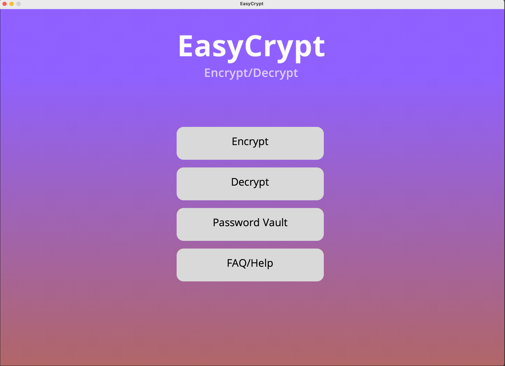
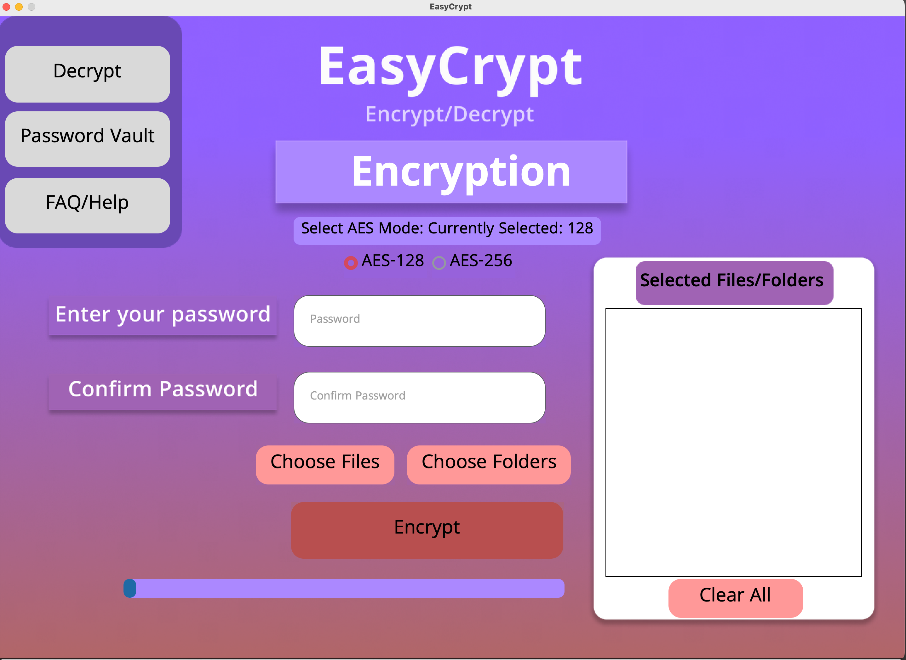
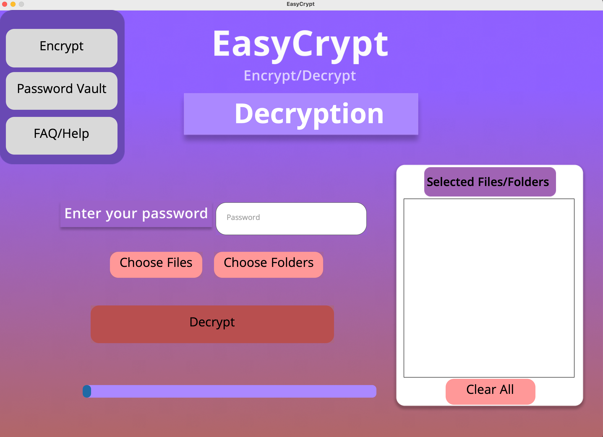
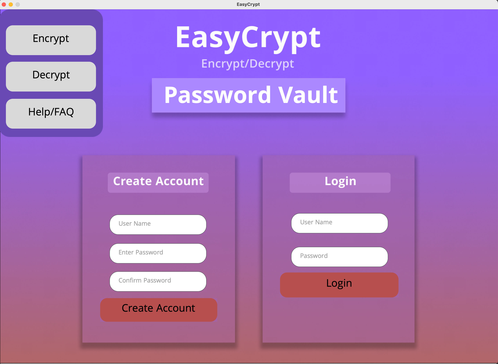

# 🔐 EasyCrypt

**EasyCrypt** is a simple, user-friendly, cross-platform encryption tool tailored for non-technical users such as students and small businesses. It uses AES-128 and AES-256 to provide strong security and includes an integrated password vault to help users manage their credentials securely.

---

## 📌 Features

- 🛡️ AES-128 and AES-256 Encryption
- 💼 Built-in Password Vault secured with a Master Password
- 🖥️ Cross-platform compatibility (Windows & MacOS)
- 📦 Built-in File Compression before encryption
- 🔒 Zero-Knowledge Architecture (no external storage of keys)
- 🔑 Strong Password Validator and Generator
- 📚 Integrated FAQ and User Guide

---

## Requirements

Make sure you have Python 3.10+ installed.

### Install Required Libraries

```bash
pip install cryptography customtkinter
```

To package the app (optional):
```bash
pip install py2app  # For MacOS users building a standalone app
```

---

## 🚀 Getting Started

1. Clone the repository or download the source code.
2. Navigate to the project directory.
3. Run the application:
   ```bash
   python main.py
   ```
4. To build as a standalone executable:
   ```bash
   python setup.py py2app
   ```

---

## 📷 Screenshots

| Homepage | Encrypt UI | Decrypt UI | Password Vault |
|---------|-------------|-------------|----------------|
|  |  |  |  |


---

## 📁 Project Structure

```
├── main.py                        # Entry point
├── BaseUI.py                     # Common GUI components
├── EncryptUI.py / DecryptUI.py  # Encryption & Decryption UIs
├── Encrypt_Decrypt.py           # AES logic (CBC mode)
├── PasswordVault_*              # Password vault UIs & DB
├── FAQ_UI.py                    # FAQ window
├── setup.py                     # Build as executable
├── images/                      # Icons, logos etc.
```

---

## 🧪 Testing Summary

| Feature                       | Status     |
|------------------------------|------------|
| AES Encryption/Decryption    | ✅ Passed  |
| Password Vault Login/Timeout | ✅ Passed  |
| UI Functionality             | ✅ Passed  |
| Error Handling & Messaging   | ✅ Passed  |

---

## 📄 License

This project is open source and available under the MIT License.

---

## 👤 Author

**Ilham Hoque**  
Cyber Security & Digital Forensics Undergraduate  
Kingston University London

---

## 💡 Future Improvements

- 🔐 Add Multi-Factor Authentication (MFA) to password vault
- 🧬 Investigate quantum-resistant encryption algorithms
- 🌐 Improve UI/UX with additional themes and accessibility support

---
